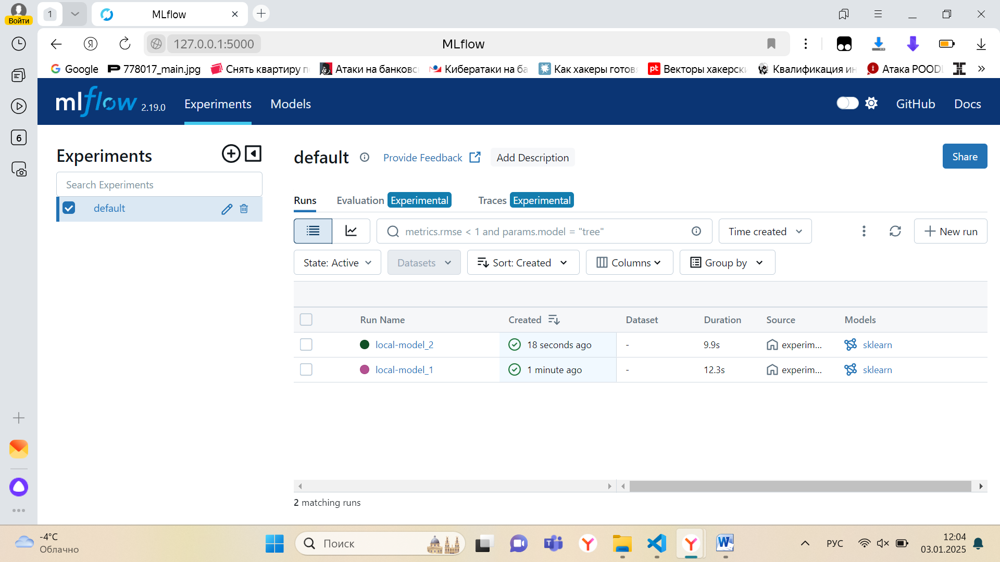
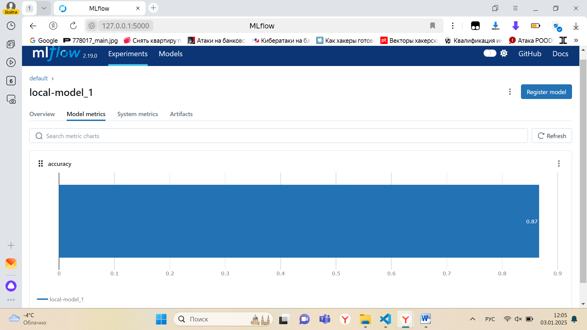
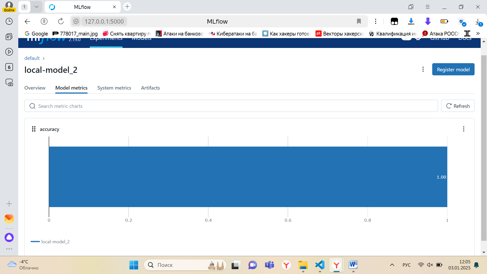

# Часть 2: управление экспериментами с MLflow
## Задача: настроить MLflow для управления экспериментами и их сравнением.
### Настройка MLflow:
Настройте MLflow для локальной работы или используйте удаленное хранилище.
Убедитесь, что все логи и модели сохраняются корректно.
### Запуск экспериментов:
Проведите как минимум два эксперимента с разными параметрами моделей.
Зафиксируйте все метрики экспериментов.
### Сравнение моделей:
Используйте MLflow для сравнения двух или более моделей по различным метрикам.
Постройте отчет о производительности моделей.
### Документация и отчет:
Составьте отчет с визуализацией результатов экспериментов, включая графики метрик и выводы.

## Результат:
Было проведено два эксперимента:

 - Эксперимент № 1:

**Параметры:**

C - 0.1

solver - liblinear

**Метрики:**

Duration - 12.3s

Accuracy - 0.8666666666666667

 - Эксперимент № 2:

**Параметры:**

C - 1.0

solver - lbfgs

**Метрики:**

Duration - 9.9s

Accuracy - 1

### Вывод:

Первая модель достигла лучших значений, чем вторая, затратив меньшее количество времени.

